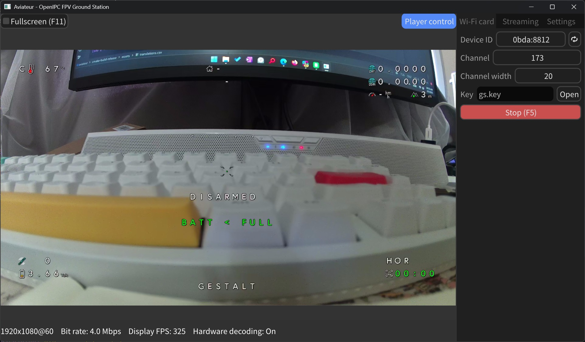
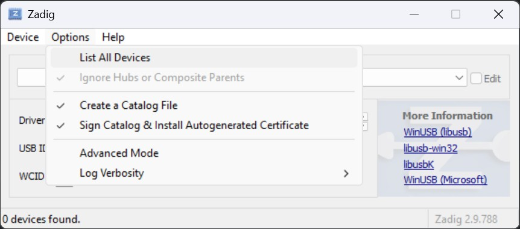
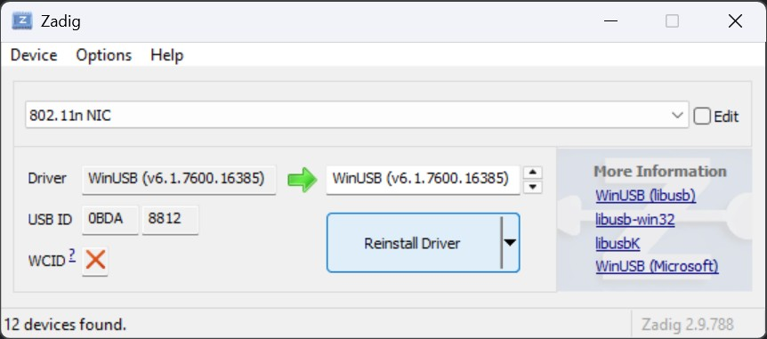
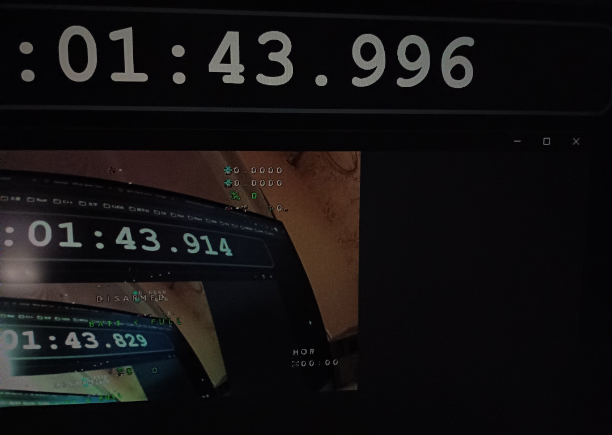
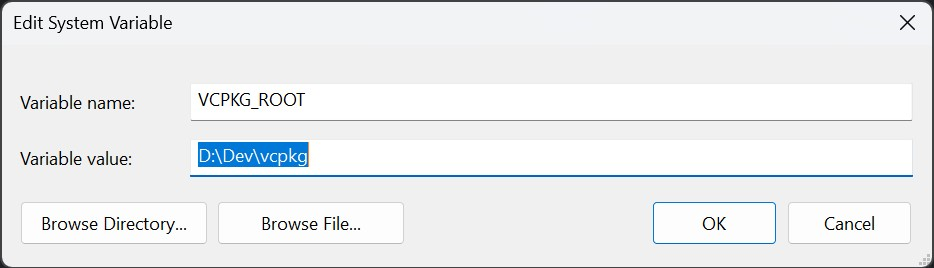

# Aviateur

<p align="center">
  <a href="https://github.com/OpenIPC/aviateur">
    
  </a>
</p>

OpenIPC FPV ground station for Windows & Linux. Forked from [fpv4win](https://github.com/OpenIPC/fpv4win]).



> [!NOTE]
> For now, only RTL8812AU Wi-Fi adapter is supported.

### Usage

1. (Only for Windows) Download [Zadig](https://zadig.akeo.ie/)
2. (Only for Windows) Install the libusb driver for your adapter.
   Go *Options* → *List All Devices*.
   
   Select your adapter. Install the driver. Remember the USB ID, we will need it soon.
   

3. Select the adapter with the previously obtained USB ID.
4. Select your drone channel.
5. Select your WFB key.
6. *Start* & Fly!

### Common run issues

* If the application crashes at startup on Windows, install [Microsoft Visual C++ Redistributable](https://learn.microsoft.com/en-us/cpp/windows/latest-supported-vc-redist?view=msvc-170#latest-microsoft-visual-c-redistributable-version) first.

### Latency test



### TODOs

- Ground side OSD

### How to build on Windows

1. Install vcpkg somewhere else.
   ```powershell
   git clone https://github.com/microsoft/vcpkg.git
   cd vcpkg
   .\bootstrap-vcpkg.bat
   ```

2. Install dependencies.
   ```powershell
   .\vcpkg integrate install
   .\vcpkg install libusb ffmpeg libsodium opencv
   ```

3. Add VCPKG_ROOT() to environment. (Change the value to your vcpkg path.)
   

4. Clone third-party library source.
   ```powershell
   git submodule init
   git submodule update
   ```

5. Open as a CMake project and build.

### How to build on Linux

1. Install dependencies.
   ```bash
   git submodule init
   git submodule update
   sudo apt install libusb-1.0-0-dev ffmpeg libsodium-dev libopencv-dev xorg-dev
   ```

2. Open as a CMake project and build.

### Common build issues

On Windows

```
CMake Error at C:/Program Files/Microsoft Visual Studio/2022/Community/Common7/IDE/CommonExtensions/Microsoft/CMake/CMake/share/cmake-3.29/Modules/FindPackageHandleStandardArgs.cmake:230 (message): ...
```

This is because the pre-installed vcpkg from Visual Studio installer overrides the PKG_ROOT environment variable.
To fix this, find `set(CMAKE_TOOLCHAIN_FILE "$ENV{VCPKG_ROOT}/scripts/buildsystems/vcpkg.cmake")` in CMakeLists.txt,
replace `$ENV{VCPKG_ROOT}` with the vcpkg you cloned previously.
